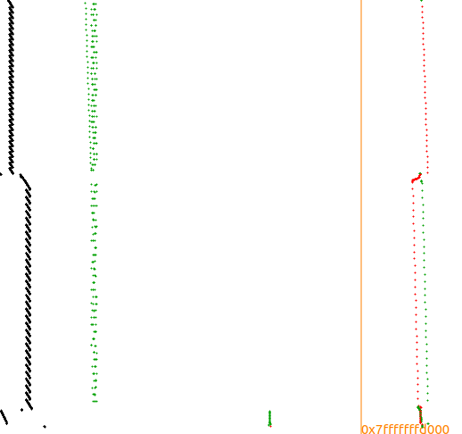

#  SM4 Implementation


## Build

```
$ mkdir build
$ cd build
$ cmake ..
$ make
```

## Run

```
$ ./SM4
```


### TracerPIN

TracerPin is a Intel PIN tool for generating execution traces of a running process. 

See the TracerPIN folder for detailed instructions.
```
Tracer -t sqlite -o aes.db -- ./aes	
```
### TraceGraph

TraceGraph is a GUI for visualizing execution traces produced by TracerGrind and TracerPin. 

See the TraceGraph folder for detailed instructions.

```
tracegraph #打开窗口化程序
```



## Reference
1. [SMx-SM4](https://github.com/NEWPLAN/SMx/tree/master/SM4)<br>